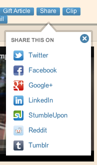
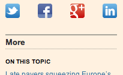
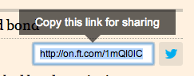
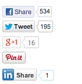

o-share [](https://travis-ci.org/Financial-Times/o-share)
=======

Social media and URL sharing buttons.

MUST

- Provide the ability to share a URL provided by the product
- Use a standard set of social media icons.
- Provide a copyable representation of a link

## Construction

__MVP:__ Products must provide the source HTML, in the following format:

```html
<ul data-o-component="o-share" data-o-version="0.1.0" class="o-share">
    <li>
        <a class="o-share__action" href="https://twitter.com/intent/tweet?text={{headline}}&url={{url}}">
            Share this on Twitter
        </a>
    </li>
    ... 
</ul>
```

__Future:__ __o-share__ will provide an API which, when passed the necessary data, will create the share link elements.

## Style options

Share buttons can be shown horizontally or vertically.

### Vertical: icons and text

This module does not provide the 'flyout' styling and behaviour, only the share button list.



### Horizontal: icons only

Icons can either be evenly spaced to fill the available space, or can have fixed spacing (controlled via CSS modifier class).

__MVP:__ Products choose which share buttons will be shown.

__Future:__ Will show as many as will fit (product expresses a priority, with lower-priority ones dropping off into a 'hamburger' icon menu?)




## Sharing a URL (envelope button)

__MVP:__ Does not include the actual copying to the clipboard (users must do that manually).

__Future:__ Provide additional button to copy to the clipboard, possibly using [zeroclipboard](https://github.com/zeroclipboard/zeroclipboard)



## Share counts

__MVP:__ Share counts will not be shown.

__Future:__ Aggregated share counts and/or individual share counts (using an Origami share count service) will be shown. Will provide a means of setting a minimum share count, below which share counts will not be shown.



## Experience

### Primary

When clicked, social media share buttons will open the social media intent links in popup windows. Only one popup will be shown for each social media network, but if a user clicks multiple social media buttons, then one popup for each will be opened.

When clicked, the URL share button will show the URL (see image above) in place of the envelope icon, in an `<input>` element. When the element loses focus, it will close.

### Core

Social media share buttons will function has plain `<a>` elements targeting a `_blank` window.

URL share button will not display at all. User can of course still copy the browser URL.

## Events

MVP: This module will trigger the following:

* `oShare.open` - when a share link has been opened (popup/flyout opened as a result of button click)
* `oShare.copy` - when the URL has been copied

Future: Will also trigger events for __o-tracking__ when the above events occur.