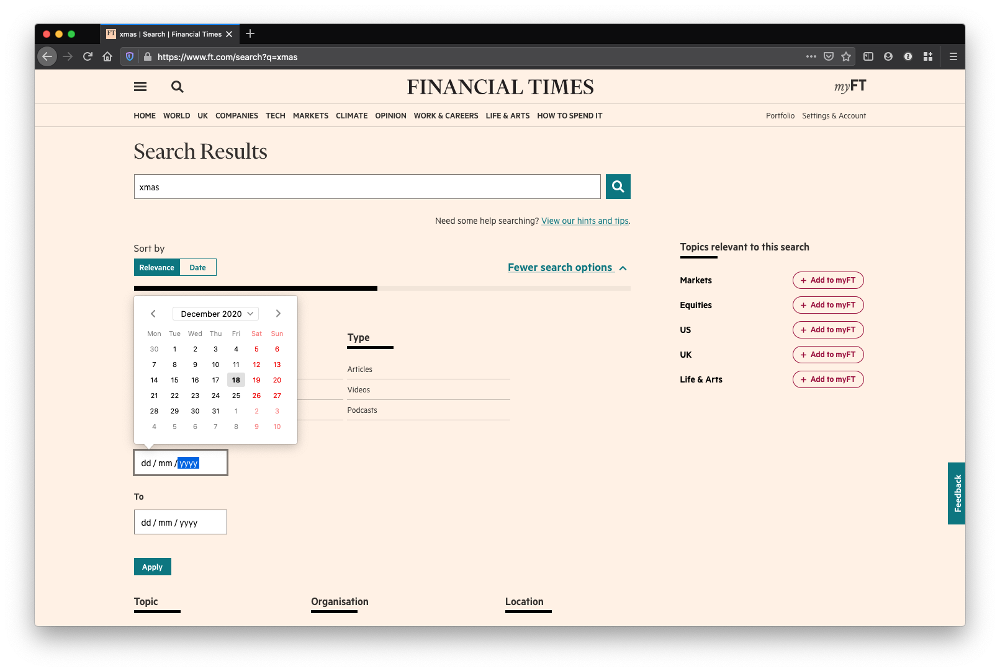
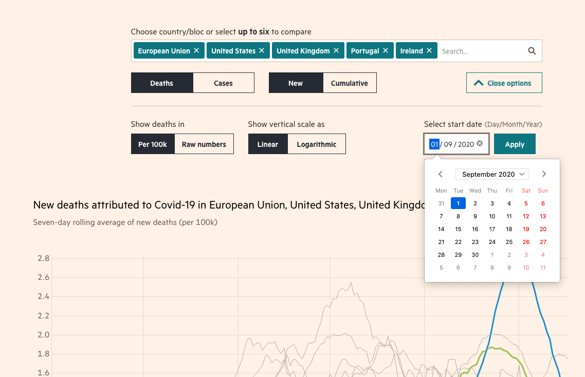
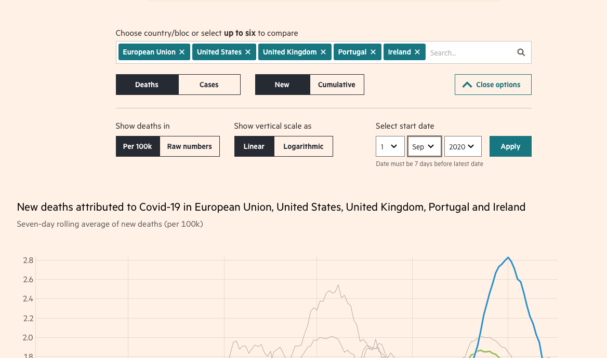
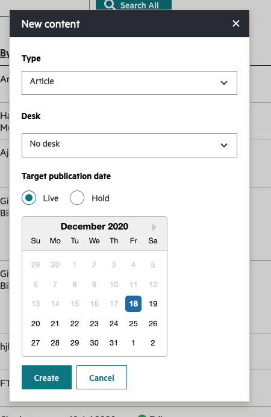
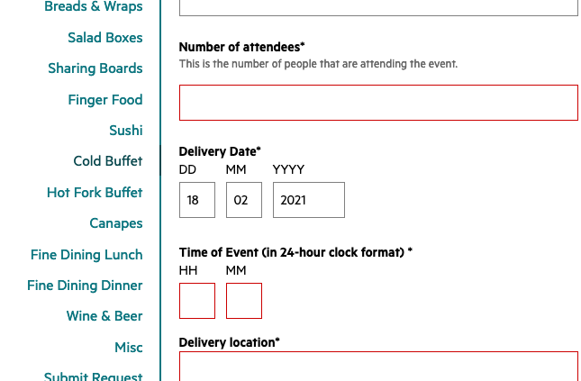

# Rationalise Date Inputs

Find examples of date inputs in ft products and document recommended components/patterns to use. This may result in creating new components, such as a date picker. Currently the only date input documented in Origami is the text-based [date input found in o-forms](https://registry.origami.ft.com/components/o-forms@8.4.1#demo-date-input).

## motivation

[o-forms includes a text-based date input](https://registry.origami.ft.com/components/o-forms@8.4.1#demo-date-input) but there are valid reasons to use other date input interfaces. A date picker, for example, is a helpful interface if the user doesn't already know the date to input but context would help them find it: a week ago, next monday, etc. Origami doesn't cater to these use-cases which has lead to repeated work and inconsistent implementations.

Continuing the date picker example there are inconsistent uses by multiple projects, internal and external. Some are native date pickers, which aren't supported by all browsers the FT supports and [may not be accessible](https://www.hassellinclusion.com/blog/input-type-date-ready-for-use/), and others are custom.

## work required

With the design teams support:
- Gather and review examples of date inputs across FT projects.
- Research date input interfaces
- Write guidelines on when to use what kind of date input.
- Open proposals for new components as required, for example a date picker.

## supporting examples

Native date picker on ft.com search (no date picker in some browsers, e.g. Safari):

Native date picker on the interactive graphics covid tracker (falls back to multiple select boxes in Safari):

Custom date picker in Spark CMS:

o-forms date input in the catering app:

