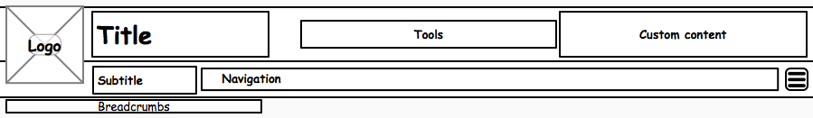

# Header [](https://travis-ci.org/Financial-Times/o-ft-header)

Responsive FT page header.

## Element containers

The header consists of the following element containers, divided into three distinct areas:

* __Primary Bar__, containing:
    * Logo
    * Title
    * Tools
    * Custom content
* __Secondary Bar__, containing:
    * Subtitle
    * Navigation
    * More Menu
    * Flyout
* __Tertiary Bar__, containing:
    * Breadcrumb

__Rough layout of header elements:__



Whilst it is possible that all optional elements may be used at once, it is unlikely to be desirable. Products should exercise restraint in what they put in it.

### Primary Bar

The Primary Bar has a background colour that extends the full width of the page. It is always be visible.

#### Logo

Required.

Normally the FT logo, but could be something else.

#### Title

Optional.

Masthead brand or product name.

#### Tools

Optional.

Individual _Tool Items_ in the _Tools_ container may have their own responsive behaviour. For example, a search input field may collapse to just be an icon button.

If there is not enough available space for a _Tool_ item to display at all, then it will be hidden there and an entry added to the _More Menu_ instead.

Core experience: Nothing will be added to the _More Menu_. What is shown in _Tools_ depends on the Tool in question.

#### Custom content

Optional.

E.g. Membership Ad or "Back to ft.com" link.

### Secondary Bar

The Secondary Bar has a background colour that extends the full width of the page. It is always be visible, even if there is no _Subtitle_ or _Navigation_, because a _More Menu_ may be required.

#### Subtitle

Optional.

Could be used to show current site section.

#### Navigation

Optional.

Primary experience: The navigation structure can be single level, or hierarchical - in which case a _Flyout_ will open when necessary.

Core experience: Top level navigation items only will be shown.

#### More Menu

Optional for preset items, required for responsively-added _Tool Item_ or _Navigation Items_.

Can be preset to contain a list of options.

Primary experience: Any _Tool_ or _Navigation_ items that cannot be displayed in their sections will be added to the More Menu.

Clicking the More Menu will open a _Flyout_.

Core experience: Hidden.

#### Flyout

Depends on Tools and Navigation contents.

Opens below the _secondary bar_, covering the _tertiary bar_.

Primary experience: Below a certain screen width, it will expand to fill the full screen width, otherwise the width will be set by the content it's showing.

Core experience: Hidden.

### Tertiary Bar

The Tertiary Bar is transparent and is not full page width. It will only be present if it has any content (e.g. there are _Breadcrumbs_).

#### Breadcrumb

Optional.

___

Draft header markup, excluding content:

```html
<div data-o-component="o-ft-header" data-o-version="2.0.0" class="o-ft-header">
    <div class="o-ft-header__primary">
        <div class="o-ft-header__logo">
            /* logo content */
        </div>
        <div class="o-ft-header__title">
            /* title content */
        </div>
        <div class="o-ft-header__tools">
            /* tools content */
        </div>
        <div class="o-ft-header__custom">
            /* custom content */
        </div>
    </div>
    <div class="o-ft-header__secondary">
        <div class="o-ft-header__subtitle">
            /* subtitle content */
        </div>
        <div class="o-ft-header__nav">
            /* navigation content */
        </div>
    </div>
    <div class="o-ft-header__tertiary">
        <div class="o-ft-header__breadcrumb">
            /* breadcrumb content */
        </div>
    </div>
</div>
```


## Tool Items

Within the _Tools_ container, there may be zero or more _Tool Items_. These consist of:

### Tool Item Button

Required.

For example, a search icon button.

### Tool Item Content

Optional.

For example, a search input field and button.

___

Draft Tool Item markup:

```html
<div class="o-ft-header__tools-item">
    <a href="http://search.ft.com" class="o-ft-header__tools-item__button"><i class="icon-search"></i> Search</a>
    <form class="o-ft-header__tools-item__content" method="get" action="http://search.ft.com/search">
        <input type="search" name="queryText" />
        <button type="submit">Search</button>
    </form>
</div>
```

## Behaviour options

### Sticky

Options: true/false/list of grid layout identifiers. (default: false)

A _sticky_ header will remain visible in the top of the viewport when the page scrolls.

### Minimizable

A _minimizable_ header header will reduce in height slightly when the page has scrolled, in order to obscure as little of the page content as possible.

Only works for _sticky_ headers. Not available for core experience.

## JavaScript

### Events

The following events will be dispatched on the __o-header__ root element:

* `oHeader.ready` Header has initialised
* `oHeader.minimise` Header has minimised
* `oHeader.maximise` Header has maximised
* `oHeader.moreMenuContentChange` Something has either been added or removed from the _More Menu_. Event detail will indicate what was added/removed.
* `oHeader.flyoutOpen` A _Flyout_ has opened. Event detail will indicate which flyout it is (_Navigation_ item, _More Menu_)
* `oHeader.flyoutClose` A _Flyout_ has opened. Event detail will indicate which flyout it is (_Navigation_ item, _More Menu_)

### API

__Methods:__

* `.minimise()` Force the header to minimise, regardless of the page scroll position.
* `.maximise()` Force the header to maximise, regardless of the page scroll position.
